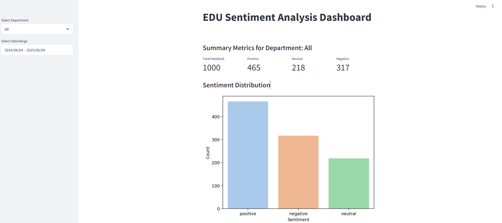
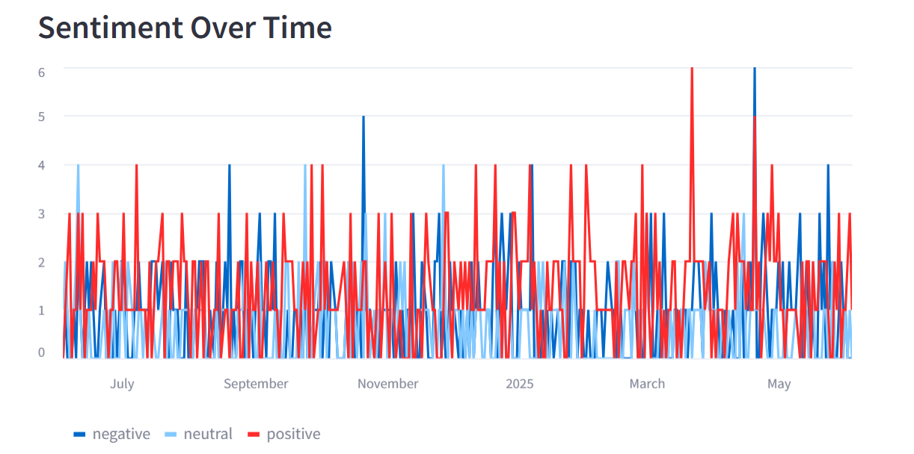
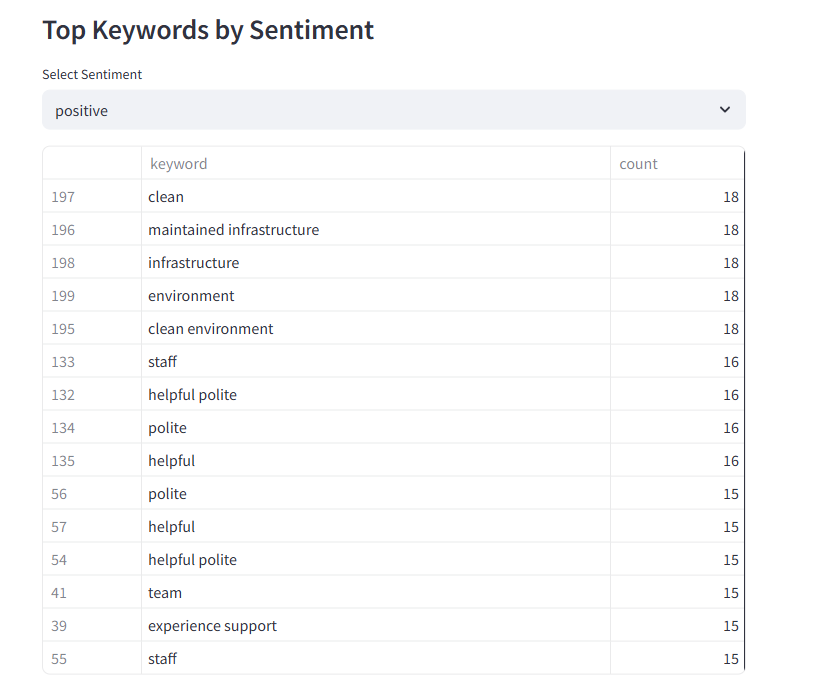
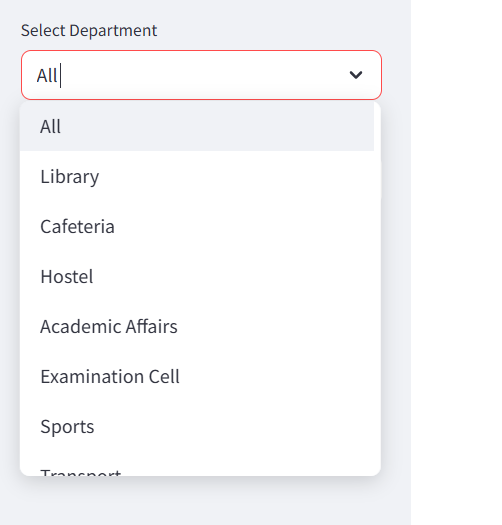
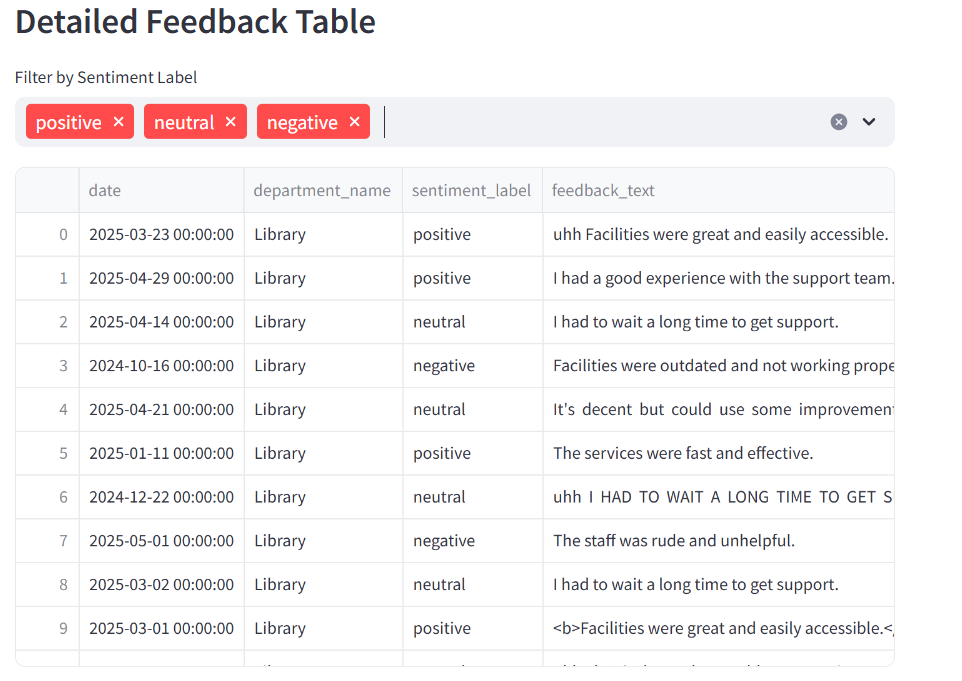

# 🎓 EDU Sentiment Analysis Pipeline

A full-stack sentiment analysis and keyword extraction system tailored for analyzing student feedback from educational institutions. The pipeline supports data ingestion from MySQL, preprocessing, NLP sentiment modeling, keyword analysis, result storage, and interactive visualization via Streamlit.

---

## 📁 Project Structure

```

edusentiment/
├── media/
    ├── dashboard_overview.png
    ├── top_keyword.png
    ├── department_filter.png
    └── feedback_table.png
├── analysis/
│   ├── accuracy.py
│   └── sentiment.py
├── data/
│   ├── departments.csv
│   ├── feedback.csv
│   ├── predictions.csv
│   ├── student_labelled_data.csv
│   └── students.csv
├── database/
│   ├── database\_input.py
│   └── database\_output.py
├── nlp/
│   ├── keyword\_extraction.py
│   ├── preprocess.py
│   ├── text\_cleaning.py
│   └── text\_tokenize.py
├── .env
├── .gitignore
├── dashboard.py
├── main.py
├── query.sql
├── requirements.txt

````

---

## 🔧 Setup Instructions

### 1. Clone the Repository
```bash
git clone https://github.com/Syed-Mohammad-Nasir-Hussain/edusentiment.git
cd edusentiment
````

### 2. Create and Activate a Virtual Environment (PowerShell)

```powershell
# Create virtual environment
python -m venv venv

# Activate the virtual environment
.\venv\Scripts\Activate.ps1
```

> If you face execution policy issues, run:
> `Set-ExecutionPolicy -ExecutionPolicy RemoteSigned -Scope CurrentUser`

### 3. Install Required Dependencies

```bash
pip install -r requirements.txt
```

### 4. Prepare `.env` File

Create a `.env` file in the root directory with your DB config:

```ini
DB_USER=root
DB_PASSWORD=your_password
DB_HOST=localhost
DB_PORT=3306
DB_NAME=edusentiment
```

---

## 🧠 Project Background

* The feedback data used here is **not real** and was created for educational purposes.
* The dataset does **not contain sentiment labels**, so we apply a **pretrained transformer model** (`cardiffnlp/twitter-roberta-base-sentiment`) to predict sentiment.
* We validate model behavior using **100 manually labeled records** just to observe result quality — this is not a supervised training setup.

---

## 📊 Model Evaluation (Sample of 100 Records)

### 🔢 Total Actual Counts

```
actual
negative    45
positive    33
neutral     22
```

### ✅ Correct Predictions per Class

```
actual
negative    20
neutral     13
positive    17
```

### 📈 Per-Class Accuracy

```
actual
negative    0.44
neutral     0.59
positive    0.52
```

### 🧮 Overall Accuracy

```
0.50
```

> Note: These values only serve as a rough sanity check.

---

## 🚀 To Run the App

### Run the Analysis Pipeline

```bash
python main.py
```

### Launch the Streamlit Dashboard

```bash
streamlit run dashboard.py
```

---

## 💡 Key Modules

| Module                  | Purpose                                                |
| ----------------------- | ------------------------------------------------------ |
| `database_input.py`     | Loads raw feedback from MySQL                          |
| `database_output.py`    | Saves processed results to MySQL                       |
| `preprocess.py`         | Cleans and normalizes feedback text                    |
| `sentiment.py`          | Applies RoBERTa-based sentiment analysis               |
| `keyword_extraction.py` | Extracts meaningful keywords                           |
| `accuracy.py`           | Compares predicted vs. actual sentiment for evaluation |
| `dashboard.py`          | Streamlit UI for monitoring feedback insights          |

---

## 📸 Dashboard Preview

Get a glimpse of what the interactive dashboard looks like when running:

### 🔹 Dashboard Overview


### 🔹 Sentiment Distribution Over Time


### 🔹 Keyword Cloud by Sentiment


### 🔹 Department-wise Filter


### 🔹 Feedback-Level Drill Down


---
## 📬 Contact

Maintained by [Md Nasir](mailto:mdnasir020396@gmail.com).
Feel free to contribute, fork, or raise an issue!
